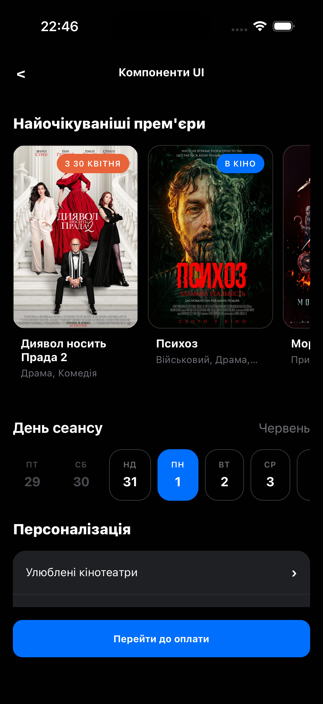
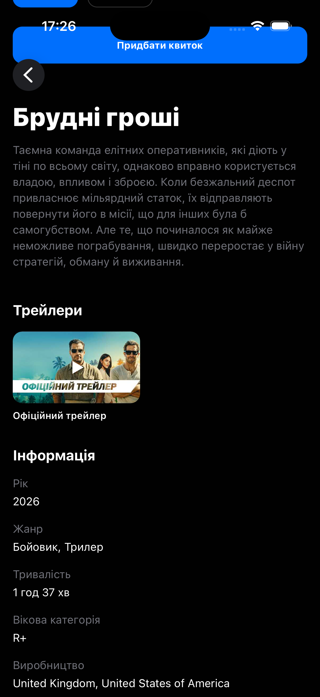
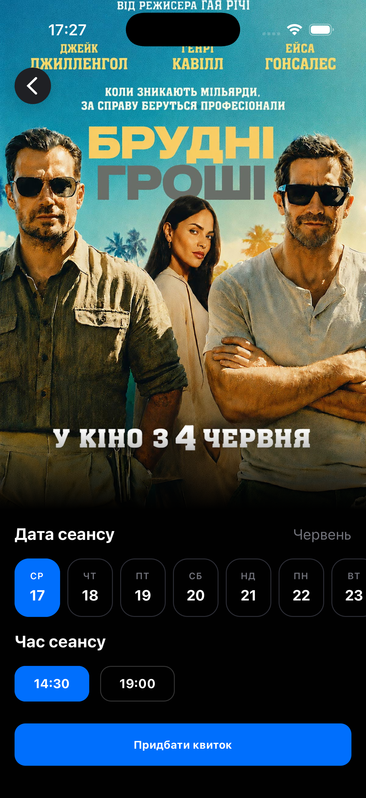
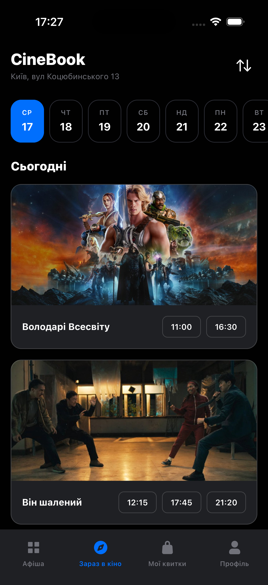
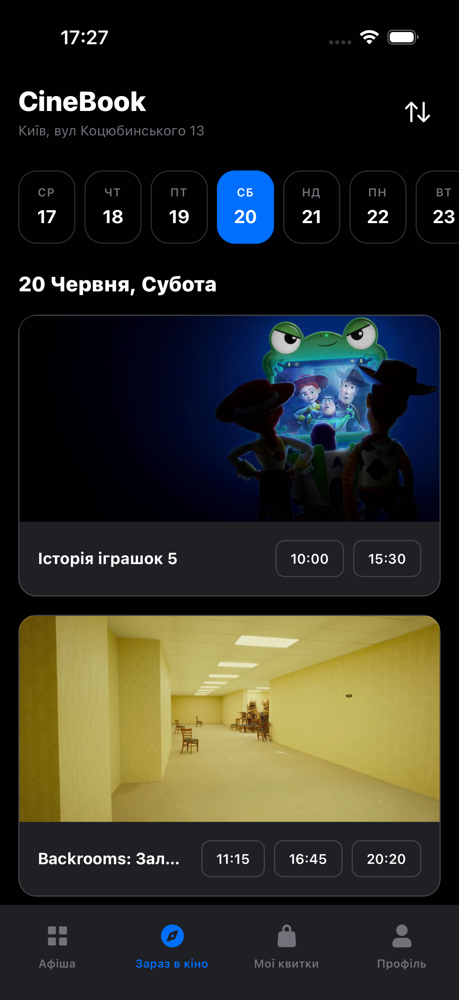
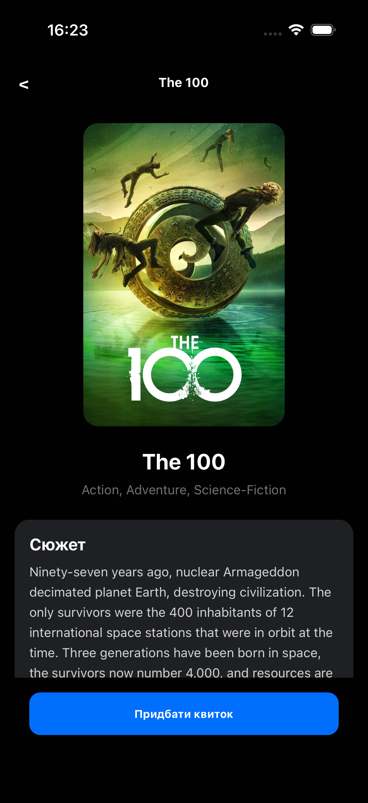

https://github.com/user-attachments/assets/e832be5b-df8e-4495-808a-199aa1b89383

https://github.com/user-attachments/assets/2cc4e9b9-bdd5-4ec2-b205-1910393b8a0f

# Cinema Booking App - UI Components

Cross-Platform Mobile App Design and Development.
Homework 3.

## Screenshots

  
  
  
  

  
  

