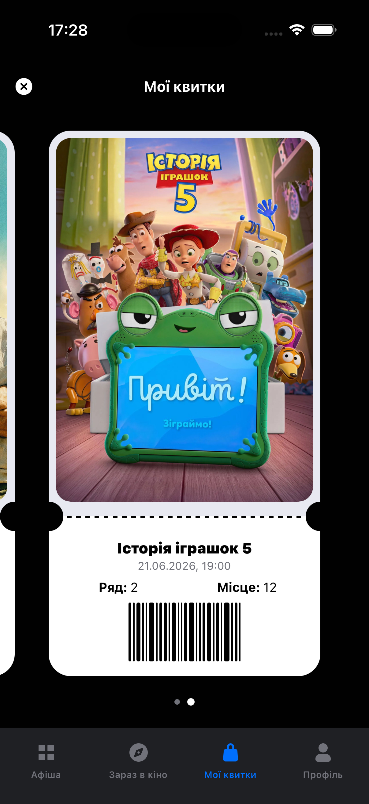
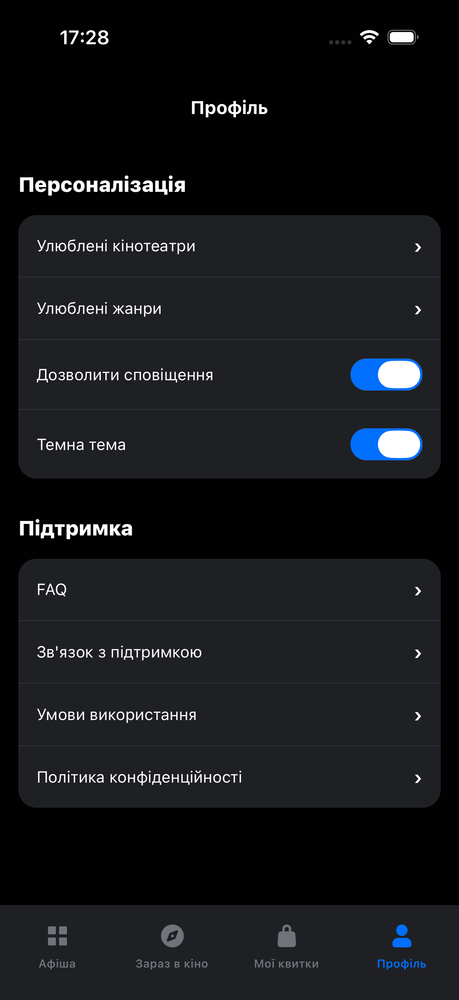
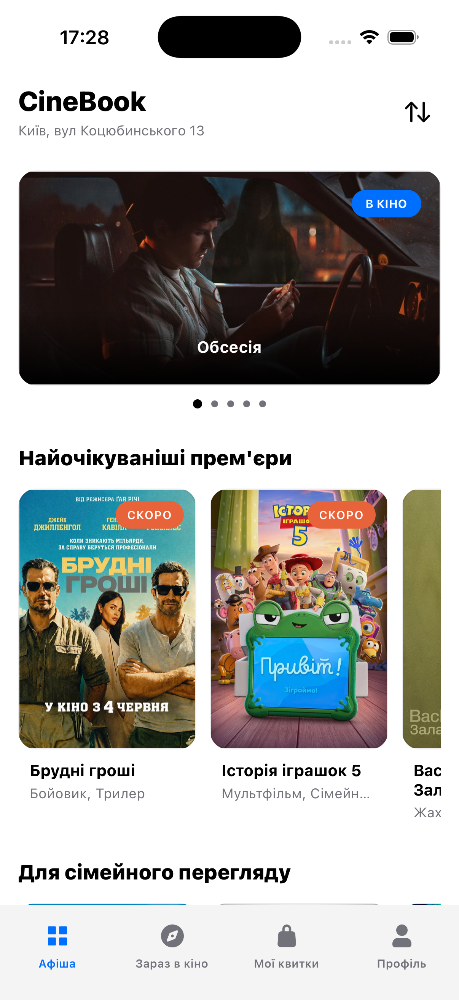
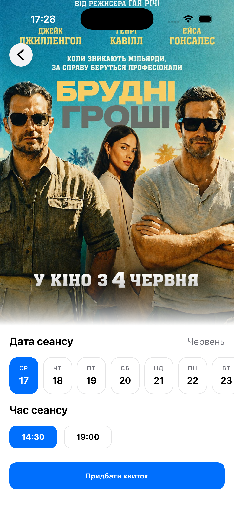
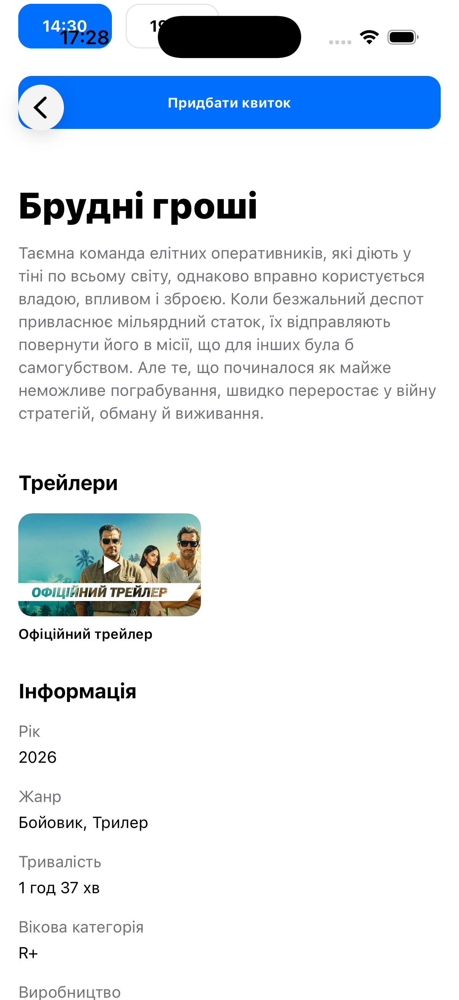
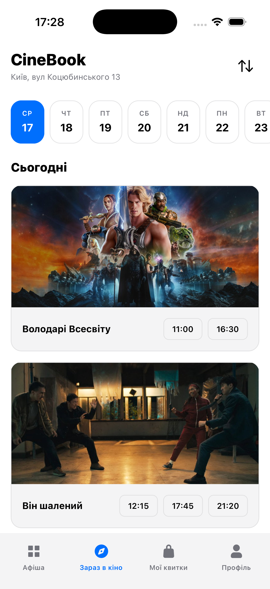
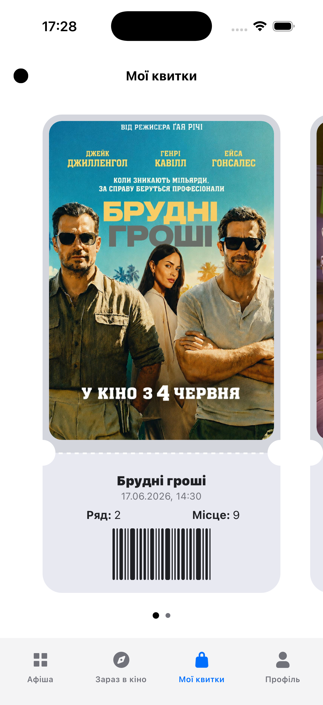
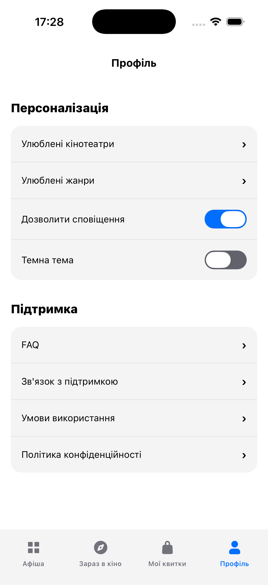

# Cinema Booking App 🎬

Сучасний мобільний застосунок для перегляду кіноафіші, розкладу сеансів та бронювання квитків. Розроблений з фокусом на високоякісний UX/UI, плавні анімації та імерсивний дизайн.

**Автор:** Dmytro Salimon

## 🌟 Ключові нововведення та фічі
- **Реальні дані (TMDB API):** Інтеграція з The Movie Database для отримання актуальних прем'єр, трейлерів, акторського складу та рейтингів з повною українською локалізацією.
- **Динамічна зміна тем (Dark/Light Mode):** Повна підтримка світлої та темної тем з адаптивними кольорами, інверсією складних UI-елементів (наприклад, карток квитків) та зміною кольорів SVG-іконок.
- **Векторна графіка:** Використання `react-native-svg-transformer` для рендерингу масштабованих та легких іконок.
- **Безпека:** Захищене зберігання API ключів через змінні оточення (`.env`).
- **Кастомні UI-компоненти:** Створено гнучкі компоненти (WeekPicker, імерсивні ScreenHeaders з градієнтами, адаптивні сітки), що забезпечують безшовний користувацький досвід.

## 🧠 Керування станом (State Management)
У проєкті використано комбінований підхід для глобального стану, щоб оптимізувати продуктивність та логіку:

1. **Context API (ThemeContext):** Використовується для керування темами застосунку (Dark/Light). Оскільки тема є глобальною константою візуального відображення, яка рідко змінюється, але потрібна майже в кожному компоненті, Context є ідеальним, легковаговим інструментом для цього завдання.
2. **Redux Toolkit (TicketsSlice):** Використовується для складної бізнес-логіки — кошика та придбаних квитків. Redux забезпечує передбачуваність стану при додаванні/видаленні квитків, спрощує серіалізацію даних та дозволяє легко масштабувати логіку (наприклад, додавання історії транзакцій у майбутньому).

## 📸 Екрани застосунку

  
  
  
  

  
  
  
  

  
  
  
  

  
  

